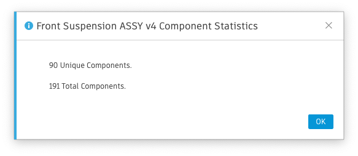

# Assembly Statistics

Simple script that displays a message box with the unique part count and total part count for the active assembly document.

Unique part count includes any local or external refrenced component. Each unique part is counted. Multiple inserts at any 
level are ignored. Unique part count provides a good indicator of overhead and size resulting from refrences.

Total part count counts all local and external components, including the same component across different assembly levels and 
multiple inserts at the same level. Patterns are an example. It descibes how big ( in component count ) and assembly is.  

  
